# Estrutura do Projeto

```text
your-cross/
├── pyproject.toml      ← Gerenciador de dependências e configurações do projeto
├── mkdocs.yml          ← Configurações da documentação
├── src/
│   ├── config/         ← Projeto Django
│   └── your_cross/     ← Pacote do sistema
├── tests/              ← Testes automatizados
├── docs/               ← Documentação do projeto
└── .venv/              ← Ambiente virtual (via poetry)
```

---

## 🧩 Arquitetura Backend (PlantUML)

[](https://editor.plantuml.com/uml/RP11QiD034NtSueX-zmWc9Js08MkIl52J6KpoLWoacPHIa_JHG-IYpMb7YS2UwVt_VqVFgg1M9rAq7Ec6GIcE4CwmuWlzb4m2YO36Wk6iF2uUnO-eN5yEbqJtiNF4A_FMs8QyjZ7mq7HBDEeNHU-xdeFSya9BZ-NRuwlNELHM7MjGwd4slyVi_20gYpOY0dcMpva0agOXHS0rP0i9qZGKBLSjFypMDNs-suTyjGlkgXDU-mTVE9bGblSgBLFUpEFlTfTVtFDdSiRovyu8htNgVm2)


---

## 🧠 Alternativa com Mermaid - Diagrama Funcional (SVG)



